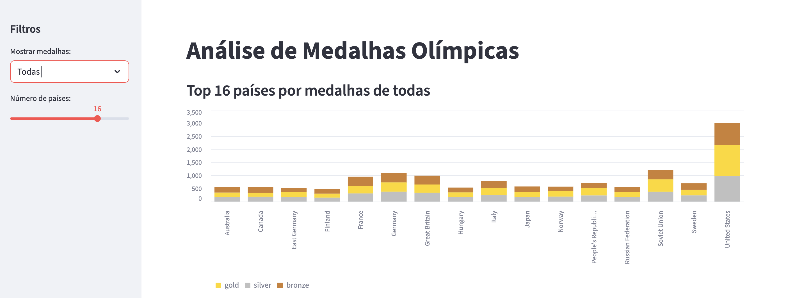

# Análise de medalhas olímpicas com Streamlit

Aplicação web para análise do quadro de medalhas olímpicas históricas, com visualização interativa dos top 10 países, pode ser alterada com filtro por tipos de medalhas.



✨ Funcionalidades
Filtros interativos (ordenar por ouro, prata, bronze ou total)

Deploy automático via Streamlit Cloud

## Como Executar

Pré-requisitos
Python 3.9+

Git

## Instalação Local

Clone o repositório:

```
git clone https://github.com/seu-usuario/olympic-medals.git
cd olympic-medals
```

## Crie um ambiente virtual (recomendado):

```
python -m venv venv
source venv/bin/activate  # Linux/Mac
venv\Scripts\activate     # Windows
````

Instale as dependências:

```
pip install -r requirements.txt
```

Execute o app:

```
streamlit run streamlit_app.py
````

🛠️ Estrutura do Projeto

olympic-medals/
├── data/                   # Dados brutos em CSV
├── src/                    # Código-fonte (análise e limpeza)
├── outputs/                # Relatórios gerados
├── streamlit_app.py        # Aplicação principal
├── requirements.txt        # Dependências
└── README.md               # Este arquivo